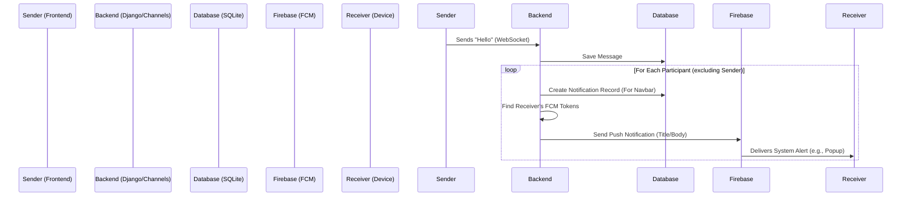

# Notification System & Firebase Workflow Overview

## 1. Overview
The chat service implements a **dual-notification strategy** for every new message to ensure users are notified whether they are currently active in the app or away.

1.  **In-App Database Notification**: For the "Notification Center" (e.g., bell icon).
2.  **Push Notification (FCM)**: Real-time system alerts (e.g., popups/mobile banners) via Firebase Cloud Messaging.

---

## 2. Workflow: Message Lifecycle

### Step 1: User Sends Message
- **Frontend** emits a message via WebSocket.
- **Backend Listener**: `ChatConsumer.receive` in `consumers.py` triggers.

### Step 2: Backend Processing
1.  **Save Message**: The `create_message` function saves the message to the `Message` table/model.
2.  **Update Conversation**: The `updated_at` timestamp of the conversation is refreshed.

### Step 3: Notification Distribution
The system iterates through all **participants** in the conversation (excluding the sender).

| Action Type | Implementation Details | File Location |
| :--- | :--- | :--- |
| **A. In-App Notification** | Creates a `Notification` record in the database (`type="NEW_MESSAGE"`). This populates the UI notification list. | `consumers.py` (Lines 36-43) |
| **B. Push Notification** | Calls `send_push_notification()` to dispatch an alert to the user's device via Firebase. | `fcm_service.py` |

---

## 3. The Role of Firebase (FCM)

**Firebase Cloud Messaging (FCM)** acts as the external delivery service. It is essential because standard WebSockets only function when the application tab is open and active.

### Key Functions
*   **Bridge to Device**: Reaches the user anywhere (locked phone, background tab, closed browser) via the OS or Browser Service Worker.
*   **Multi-Device Delivery**: A single user ID can be mapped to multiple devices (laptop, phone, tablet). Firebase handles the multicast delivery to all of them simultaneously.

### Technical Flow (`fcm_service.py`)
1.  **Initialization**: Connects using `firebase_credentials.json` or Environment Variables.
2.  **Token Lookup**: Fetches `FCMToken` records associated with the receiving `user_id`.
3.  **Dispatch**: Sends a `MulticastMessage` with a title and body to Firebase servers, which then route it to the specific devices.

---

## 4. Visual Diagram

